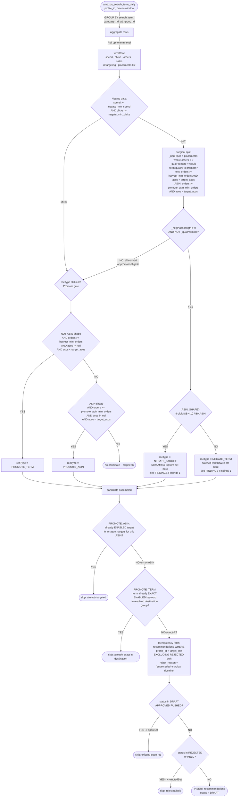
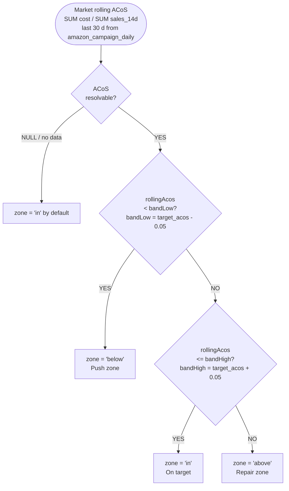
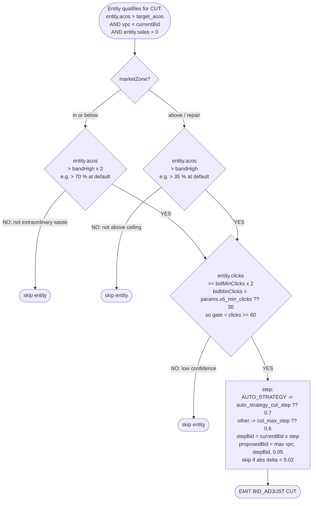
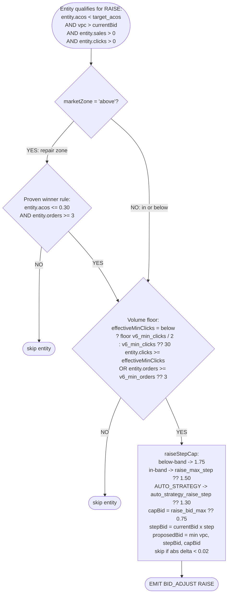
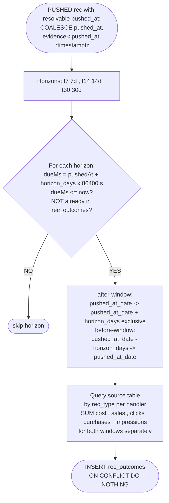
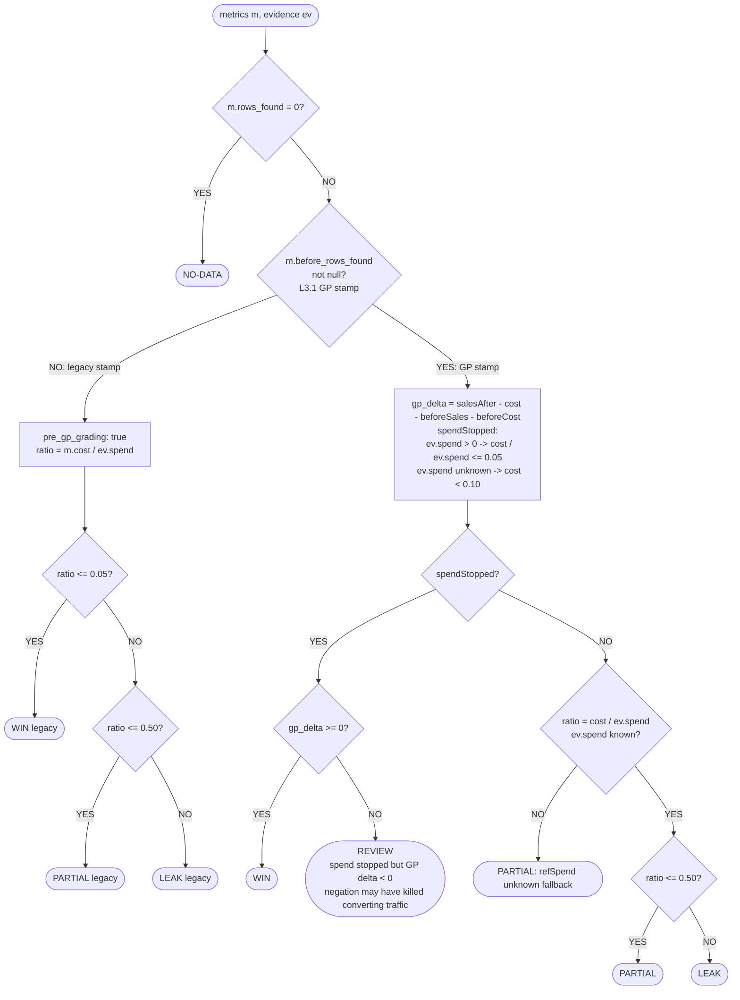
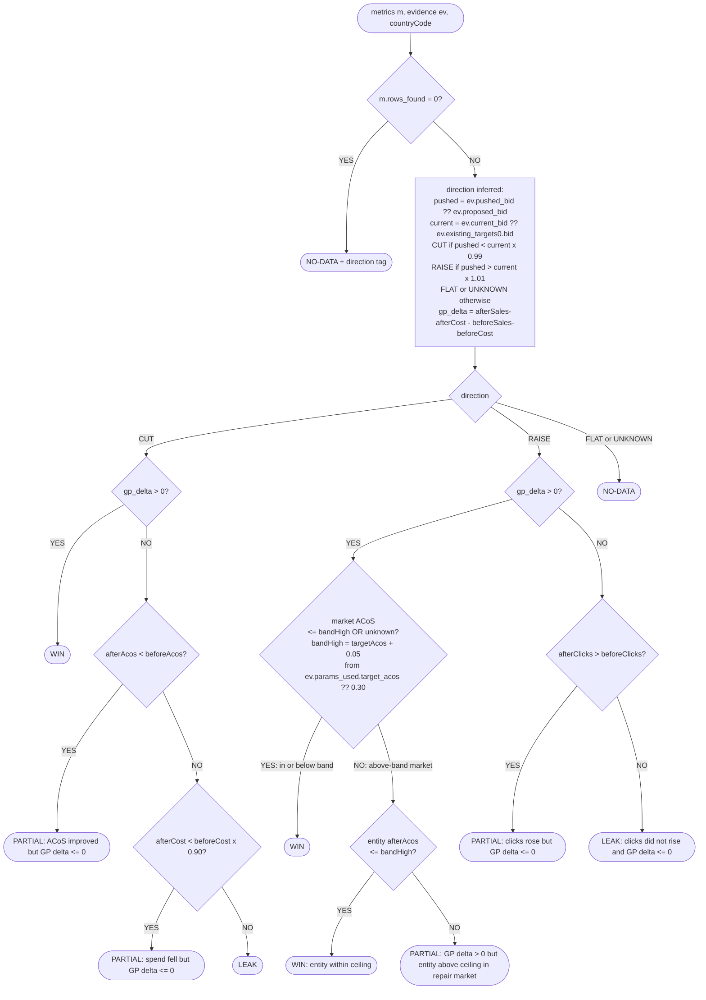
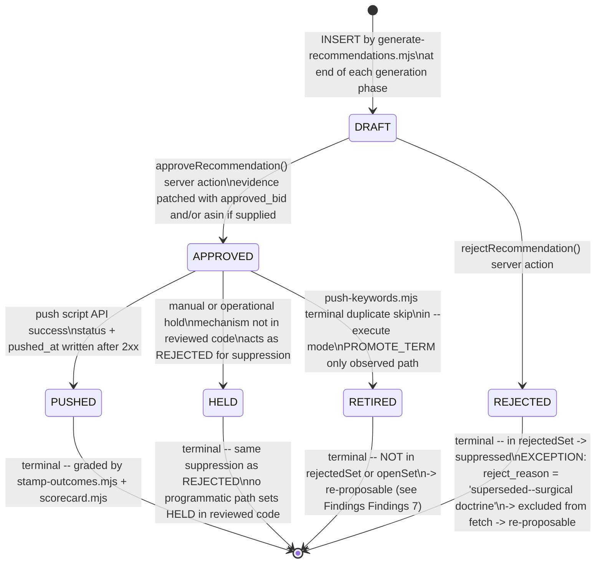

<!-- FRAME RULE: Any frame that touches generation/push/grading logic MUST update this file in the same commit. -->

# doctrine.md — CdL Ads Engine Decision-Tree Spec

> **Extracted from code as it EXISTS on 2026-08-12.**
> Where code contradicts a section header, the code's truth is recorded with a ⚠ note.
>
> **FRAME RULE: Any frame that touches generation/push/grading logic MUST update this file in the same commit.**

Sources: `scripts/generate-recommendations.mjs` · `scripts/stamp-outcomes.mjs` · `scripts/scorecard.mjs` · `scripts/push-negatives.mjs` · `scripts/push-negative-targets.mjs` · `scripts/push-keywords.mjs` · `scripts/push-bid-adjustments.mjs` · `scripts/push-structure.mjs` · `app/amazon/recommendations/actions.ts` · `app/lib/rec-scope.ts`

---

## GP Basis

**Ruling (migration 028, 2026-08-27):** Engine GP is computed as `purchases_14d × gp_per_order − spend`, per profile, in native currency. No FX conversion is ever applied.

`gp_per_order` is a business ruling stored in `amazon_profiles.gp_per_order` (nullable `numeric`). Ruled values: US profile `139446882235960` → 4.40 USD/order; ES profile `2263723137827296` → 5.00 EUR/order. All other profiles `NULL`.

**Per-order, not per-unit:** The margin is applied per order (`purchases_14d`), not per unit sold. Multi-unit orders count as one order. This produces a ~6% GP understatement by design — conservative by ruling. No `units` column exists in any daily table; no derivation from orders to units is permitted.

**NULL semantics:** `NULL` `gp_per_order` means no margin ruling has been made for that profile. Revenue-based GP (`sales − spend`) is retained and labeled as such. `NULL` must never be treated as zero, derived, or converted.

**Arithmetic switch (frame 2, 2026-08-27):** Grading now runs on `gp_per_order` where ruled. Every new stamp carries `gp_basis` (`'unit'` or `'revenue'`) and `gp_per_order` in its metrics JSON. The scorecard resolves GP via `computeGP` / `resolveGP` at judgment time — reading `gp_basis` and `gp_per_order` from the already-stamped metrics.

**Mixed-basis aggregation banned:** `gp_delta` values from `gp_basis='unit'` and `gp_basis='revenue'` stamps must never be summed or medianed together. The scorecard prints them separately by basis in all display sections.

**Generation-side gates (frame 3, 2026-08-27):** Where `gp_per_order` is ruled, the generator evaluates at-risk quantities in GP terms. For BID_ADJUST CUT cards: `est_at_risk_gp = orders × gp_per_order − spend` is written to evidence alongside `est_at_risk_sales` (kept for continuity). `gp_basis` is written to every BID_ADJUST card evidence. Thresholds, band logic, and all other gate conditions are unchanged — only the GP quantity inside them changes basis. Where `gp_per_order` is NULL, `est_at_risk_sales` is the only at-risk field and `gp_basis` records `'revenue'`.

**Display conventions (frame 4, 2026-08-27):** The dashboard (VerdictStrip, MoversRow) consumes `profileGP` from `app/lib/scorecard.ts` — the same basis resolution as the scorecard. Unit-basis GP displays plain; revenue-basis GP displays with an italic `rev` label. Mixed-basis figures (different `gp_basis` within the same currency) are shown side-by-side and are never summed. Sales and spend rows continue to aggregate by currency only (unchanged). Movers delta pre-computed in the server page using `profileGP`; SQL sort order remains revenue-based for ranking.

**Dashboard margin gauge (dashboard overhaul frame 1, 2026-08-30):** The 30-day market cards render the gauge only for unit-basis profiles (`gp_per_order` non-null). The fixed 50% tick is the ruled per-order margin; the marker is cost per order (`spend ÷ orders`) positioned at `clamp(cost_per_order ÷ (2 × gp_per_order), 3%, 97%)`, so the left half is earning and the right half is losing. With spend and zero orders, cost per order displays `—` and the marker is pinned at 97%; division by zero is forbidden. Revenue-basis profiles (`gp_per_order` null) display `sales − spend` labeled `revenue − spend, 30 days (pre-COGS)` and a disabled gauge reading `gauge unavailable — rule a <CUR> margin to enable`; revenue figures must never position a gauge marker.

**Channel GP (display) (dashboard overhaul frame 2, 2026-08-30):** On a unit-basis market card, trailing-quarter channel GP = `SUM(vendor_history.units) × amazon_profiles.gp_per_order − SUM(console_history.spend)` across the latest three consecutive vendor months; console spend is the all-ad-types monthly export. The block renders only when `gp_per_order` is ruled, the market has a three-month consecutive vendor window, and `console_history` has rows for those exact same months; otherwise it is silently omitted. Units/month = three-month vendor units ÷ 3, and attribution share = same-window console orders ÷ vendor units. `vendor_history` and `console_history` are queried separately and passed as separate props; they meet only in `ChannelBlock`, never in SQL or page shaping, and neither is joined to `daily_rollup` or `experiments`. The vendor sell-in caveat remains in force: purchasing is batched and lagged, and channel GP is therefore a quarterly-grain display metric only, never an engine, grading, generation, push, or watchdog input.

**SalesSpendChart GP line (frame 5, 2026-08-28):** The chart's Ad GP series is basis-resolved via the same `profileGP` logic. Unit-basis profiles (`gp_per_order` non-null): GP line = `gp_per_order × rolling_avg(orders) − rolling_avg(spend)`; legend label = `'Ad GP (30d)'`. Revenue-basis profiles (`gp_per_order` null): GP line = `rolling_avg(sales) − rolling_avg(spend)`; legend label = `'Ad GP (30d) (rev)'`. The shaded fill between the rolling sales and spend lines is unchanged (visual decoration only). Rolling window (30 d) and all other chart series (sales, spend, ACoS) are unchanged. `daily_rollup.orders` and `amazon_profiles.gp_per_order` are fetched in the chart SQL query; `gpPerOrder` flows through `MarketChartData → ChartSection → SalesSpendChart` as `number | null`.

**Historical grades:** Stamps created before this frame lack `gp_basis` in their metrics. They are identified by absence of `gp_basis` (the scorecard defaults to `'revenue'` when the field is absent) and were graded on revenue-based GP. The `pre_gp_grading` tag on legacy stamps (those lacking a before-window) remains the explicit audit marker; all pre-frame-2 stamps are implicitly revenue-basis by absence.

**Long-term · Rolling-12 Chart (console_history, frame 6, 2026-08-28):** Monthly console exports are a display-only truth layer stored in `console_history`. They are **never joined to `daily_rollup`** in any query and **never read by any generation, grading, or watchdog rule**. Scope includes all ad types (SP, SB, SBV, SD); API `daily_rollup` is SP/SB only — the completeness difference is the point. Source labeling is mandatory on every chart card that renders `console_history` data: *source: console exports - monthly - all ad types*.

**Vendor sell-in truth layer (`vendor_history`, 2026-08-30):** Amazon Vendor invoice history is a second display-only truth layer beside `console_history`. It records Amazon's replenishment purchasing (sell-in), not customer sell-through; purchasing is batched and lagged, so monthly rows may be read only at quarterly-or-coarser grain for trend judgments. `vendor_history` is **never joined to `daily_rollup`, `console_history`, or any other table** and is **never read by generation, grading, or watchdog rules**. The Long-term chart renders rolling-12 vendor revenue as a dashed overlay on the native-currency money axis and rolling-12 vendor units as a dashed line in a separate sell-in-vs-attributed units panel. The two truth layers meet only as separately shaped component props, never in a database query. The units panel face carries the quarterly-grain caveat and is omitted when a market has no vendor rows.

**Rolling-12 window rule:** A rolling-12 point at month M = sum of months M−11 through M (inclusive, 12 months). A point is plotted only when all 12 consecutive months are present in `console_history` — partial windows are never plotted. Markets with fewer than 12 months of history (e.g. CA, 4 months as of 2026-08) are silently excluded.

**GP basis in the rolling-12 chart:** Same `profileGP` resolution as the 90-day charts. Unit-basis (US, ES): `orders12 × gp_per_order − spend12`. Revenue-basis (MX, `gp_per_order` null): `sales12 − spend12`; legend shows "Rolling-12 GP (rev)". `gp_per_order` is fetched from `amazon_profiles` at page-render time; the component never queries the database directly.

**Rolling-12 Y-axis:** `yMin = min(0, 1.1 × lowest plotted value)` across all three series (spend, sales, GP). When `yMin < 0` the y=0 gridline is rendered heavier and darker (same rule as SalesSpendChart, commit 2cf40e6). Currencies native per market, never converted.

---

## a. CANDIDATE PIPELINE

### Flowchart

### Legend

**Evaluation window**
`windowEnd = today − params.negate_attribution_buffer_days` (days);
`windowStart = windowEnd − params.negate_window_days` (days).
Both are UTC-date ISO slices from `amazon_search_term_daily`.

**ASIN_SHAPE**: `/^([0-9]{9}[0-9xX]|b0[a-z0-9]{8})$/i` — determines NEGATE_TARGET vs NEGATE_TERM and PROMOTE_ASIN vs PROMOTE_TERM.

**Classification order is NEGATE first, then PROMOTE.**
A term that passes the spend/click floor *and* the promote bars skips negation only if `_qualPromote` is true. If `_qualPromote` is true, no negate card is written; the term falls through to the promote check instead.

**Surgical split (negate path)**
Placements with `orders > 0` are tagged `negate: false, kept_reason: 'converting'` — they are excluded from push scope.
Placements with `orders = 0` are tagged `negate: true` — only these reach the API.

**Doctrine-supersession exception**
The idempotency query excludes `REJECTED` rows where `evidence->>'reject_reason' = 'superseded—surgical doctrine'`. Those recs do not enter `rejectedSet` and thus can be re-proposed when the surgical split has changed.

**v6 BID_ADJUST** runs in Phase 5.5 — a separate sub-phase over `bidEntities` collected from `amazon_targets`, `amazon_keywords`, and `amazon_targets[AUTO]`. It does not use `termRows`. See Section b.

**acos = null when sales = 0** — division-by-zero guard; such terms never qualify for promotion.

**Param names to cite when tuning**:
`negate_min_spend` · `negate_min_clicks` · `harvest_min_orders` · `promote_asin_min_orders` · `target_acos` (from `amazon_profiles.target_acos`, not engine_parameters) · `negate_attribution_buffer_days` · `negate_window_days` · `promote_bid_cpc_multiplier` · `promote_bid_max`

---

## b. BAND & BID GATES

### Market Zone Computation

> ⚠ At default `target_acos = 0.30` the band is 25–35%.
> `target_acos` is read from the **profile row** (`amazon_profiles.target_acos`), not from `engine_parameters`.
> `scorecard.mjs` hardcodes `BAND_LOW = 0.25 / BAND_HIGH = 0.35` for display — diverges from engine if `target_acos` is tuned. See Findings #4.

### CUT Gate (per zone)

### RAISE Gate (per zone)

**vpc** = `round((entity.sales / entity.clicks) × target_acos, 2)` — value per click at target ACoS.

**DEFUSE** (TARGET entity only, Phase 5.5):
`entity.spend > 0 AND entity.sales = 0` →
`proposedBid = max(round(currentBid × (cut_max_step ?? 0.6), 2), 0.05)`.
Skip if `|delta| < 0.02`. Tagged as CUT direction in evidence.

**REVIVE** (Phase 7c, `rec_type = BID_ADJUST`, `evidence.kind = 'REVIVE'`):
Campaign with `spend_30d < 2`, `lifetime_sales > 0 OR lifetime_orders > 0`, `max_enabled_bid < viabilityFloor`.
`viabilityFloor` = median bid across ENABLED targets+keywords in campaigns with `spend_30d ≥ 10`; fallback = `target_acos`.
v2: per-entity bids from `amazon_bid_recommendations` (≤ 7 d fresh); else uniform `viabilityFloor`.

**BUDGET_ADJUST** (Phase 7):
`avg_daily_spend ≥ budget × 0.85 AND acos_30d < target_acos AND orders_30d ≥ 5` →
`proposedBudget = min(budget × 1.5, budget + 20)`.

**PAUSE_CAMPAIGN** (Phase 7b):
`spend_30d ≥ 30 AND (acos_30d ≥ 1.0 OR sales_30d = 0)`.

**DORMANT-PAUSE** (Phase 7d, emitted as PAUSE_CAMPAIGN):
`spend_30d < 2 AND lifetime_impressions < 500 AND lifetime_sales = 0`.
Hard exclude: campaign name `LIKE 'CDL | SP |%'`.
Age guard skipped — creation date unavailable (see Findings #10).

---

## c. PUSH LAYER

### Per rec-type → script → scope → receipt shape

```mermaid
flowchart TD

    subgraph NT["NEGATE_TERM -> push-negatives.mjs"]
    NT1(["APPROVED NEGATE_TERM\nlimit: push_max_per_run ?? 20"]) --> NT2{"Eligibility filter"}
    NT2 -- evidence.is_targeting = true --> NTS1(["skip: needs neg targeting clause"])
    NT2 -- ISBN-10 shape /^0-9...9xX$/ --> NTS2(["skip: ISBN-10 belt-and-braces"])
    NT2 -- no campaigns in evidence --> NTS3(["skip: no campaigns"])
    NT2 -- pass --> NT3["Scope resolution:\ncampaign_ids from negate:true placements only\nconverting placements excluded surgically"]
    NT3 --> NT4["POST /sp/campaignNegativeKeywords\nmatchType: NEGATIVE_EXACT\nstate: ENABLED\ncampaign-level -- no adGroupId sent\nreceipt: SP v3 multi-status JSON"]
    end

    subgraph NTA["NEGATE_TARGET -> push-negative-targets.mjs"]
    NTA1(["APPROVED NEGATE_TARGET\nlimit: push_max_per_run ?? 20"]) --> NTA2{"Eligibility:\nmatch ASIN_SHAPE?"}
    NTA2 -- NO --> NTAS(["skip: not ASIN shape"])
    NTA2 -- YES --> NTA3["Scope: campaigns from\nnegate:true placements only"]
    NTA3 --> NTA4["POST /sp/campaignNegativeTargets\nexpression: ASIN_SAME_AS target_text.toUpperCase\n[warn] resource + expression type\nto confirm on first live response"]
    end

    subgraph PT["PROMOTE_TERM / CREATIVE_KEYWORD -> push-keywords.mjs"]
    PT1(["APPROVED PROMOTE_TERM\nor CREATIVE_KEYWORD\nlimit: push_max_per_run ?? 20"]) --> PT2["Load orphan route map\nfrom PUSHED CREATE_STRUCTURE evidences\nevidence.orphan_rec_ids -> ad_group_id"]
    PT2 --> PT3{"Destination resolution"}
    PT3 -- rec id in orphanRouteMap --> PT3A["Route to structure room\nevidence.created_ad_group_id"]
    PT3 -- CREATIVE_KEYWORD with destination_ad_group_id --> PT3B["Use explicit destination\nbypass tier logic"]
    PT3 -- standard tier --> PT3C["Tier A: placement where\nexactKws >= 1\nAND hasAuto = 0\nAND NOT autoCampaign\nsorted by spend desc\nTier B: same but anyKws >= 1\nNo tier -> skip"]
    PT3A & PT3B & PT3C --> PT4{"Duplicate:\nalready EXACT ENABLED\nin destination group?"}
    PT4 -- YES -> terminal --> PT5(["self-retire RETIRED in execute mode\ndry-run: print and skip"])
    PT4 -- NO --> PT6["Bid: evidence.approved_bid\nOR evidence.proposed_bid\nPOST /sp/keywords\ncampaignId + adGroupId\nkeywordText matchType:EXACT\nstate: ENABLED\nBorn ENABLED not PAUSED"]
    end

    subgraph BA["BID_ADJUST -> push-bid-adjustments.mjs"]
    BA1(["APPROVED BID_ADJUST\nlimit: push_max_per_run ?? 20"]) --> BA2{"evidence.kind\n= 'REVIVE'?"}
    BA2 -- YES --> BA3["Fetch ALL ENABLED targets+keywords\nin evidence.campaign_id\nv2: per-entity bid from evidence.per_entity\nelse uniform proposed_bid\nPUT /sp/targets\nPUT /sp/keywords\none call per entity batch"]
    BA2 -- NO --> BA4{"entity_kind"}
    BA4 -- TARGET or AUTO_STRATEGY --> BA5["PUT /sp/targets\ntargetId: evidence.entity_id\nbid: approved_bid ?? proposed_bid"]
    BA4 -- KEYWORD --> BA6["PUT /sp/keywords\nkeywordId: evidence.entity_id\nbid: approved_bid ?? proposed_bid"]
    end

    subgraph CS["CREATE_STRUCTURE -> push-structure.mjs"]
    CS1(["APPROVED CREATE_STRUCTURE\nHARD CAP: 2 per run\nnot a param -- hardcoded const"]) --> CS2["1 POST /sp/campaigns\nstate: PAUSED deliberately\ntargetingType from evidence.targeting_type\nbudget from evidence.budget or 3.00/day\nstartDate: today ISO date"]
    CS2 --> CS3["2 POST /sp/adGroups"]
    CS3 --> CS4["3 POST /sp/productAds\nseed_asins from evidence.seed_asins"]
    CS4 --> CS5(["Born PAUSED\nChristian enables in console\nor later frame flips state"])
    end
```

### Legend

**push_max_per_run**: `params.push_max_per_run ?? 20` applies to all push scripts **except** CREATE_STRUCTURE, which uses the hardcoded constant `2`.

**Orphan route map** is built from **PUSHED** (not APPROVED) CREATE_STRUCTURE evidences. APPROVED-but-not-yet-PUSHED structure rooms do not yet route orphan PROMOTE_TERM recs; those orphans skip at push time (see Findings #11).

**Duplicate-is-satisfied (PROMOTE_TERM)**: EXACT keyword already ENABLED in the destination ad group → terminal skip. In execute mode the rec is self-retired to `RETIRED` status. `RETIRED` is not in the generation suppression check → re-proposable (see Findings #7).

**Born-PAUSED rule applies only to CREATE_STRUCTURE campaigns.** Keywords (PROMOTE_TERM push), negatives, and bid adjustments are not born paused — they become effective immediately on API success.

**Default bid fallback in push-structure**: `evidence.proposed_default_bid ?? max(keywords[].bid) ?? 0.75`.

### Cluster-Room Market Mapping (`CLUSTER_LANG_MAP`)

Controls which profiles participate in `cluster_auto_room`, `cluster_kw_room`, and `orphan_kw_room` generation phases. Absent profiles are skipped with a log line (`cluster-room phases skipped — no language mapping for profile <id>`).

| Profile ID | Market | Language | Status |
|---|---|---|---|
| 2263723137827296 | ES (Spain) | spa | active |
| 139446882235960 | US | eng | active |
| 1711934819800765 | UK | eng | active |
| 2213278747143677 | DE (Germany) | eng | active — onboarded 2026-08-12; three rooms approved (Dreams\, Creativity & Art · Emotions & Feelings · Wellbeing & Life's Journey); Inspiring Real Stories held back pending verdict |
| 3035560362970447 | FR (France) | — | **unmapped by deliberate ruling** — pending DE verdict |
| 2286455750996728 | IT (Italy) | — | **unmapped by deliberate ruling** — pending DE verdict |

Budget default: `ev.budget ?? 3.00` (DAILY). All cluster rooms are born PAUSED. Christian enables in console.

---

## d. GRADING

### Stamp Windows & Horizons

**Source tables by rec_type**:
`NEGATE_TERM / NEGATE_TARGET / PROMOTE_TERM / CREATIVE_KEYWORD / PROMOTE_ASIN / CREATIVE_TARGET` → `amazon_search_term_daily` (by `search_term` or `lower(search_term)`)
`BID_ADJUST / BUDGET_ADJUST / PAUSE_CAMPAIGN / CREATE_STRUCTURE` → `amazon_campaign_daily` (by `campaign_id`)
`REPLACE_PRODUCT_AD` → `amazon_advertised_product_daily` (by `asin + campaign_id` for B0 and HC separately)

### NEGATE_TERM / NEGATE_TARGET Verdict

### BID_ADJUST Verdict (CUT and RAISE)

### Other Types (abbreviated)

**REPLACE_PRODUCT_AD**:
`rows_found = 0` → NO-DATA.
`b0Dark AND hcServe` → WIN. `b0Dark AND NOT hcServe` → PARTIAL. `NOT b0Dark AND hcServe` → PARTIAL. `NOT b0Dark AND NOT hcServe` → LEAK.
`gp_delta = (hc_sales + b0_sales − hc_spend − b0_spend)_after − same_before` (informational).

**PROMOTE_TERM / CREATIVE_KEYWORD / PROMOTE_ASIN / CREATIVE_TARGET**:
`rows_found = 0` → NO-DATA.
`clicks = 0` → LEAK (dark).
`clicks > 0`:
  `gp_delta > 0` → WIN (STRONG: gp_delta>0).
  `horizon = 't14' AND purchases > 0` → WIN (STRONG: orders>0 at t14).
  else → WIN (serving at `horizon`; clicks>0 impression proxy).
`gp_delta` computed only when `before_rows_found` present.

**PAUSE_CAMPAIGN**:
`afterCost < 0.10` → WIN. `afterCost < beforeCost × 0.50` → PARTIAL. Else LEAK.

**BUDGET_ADJUST** ⚠:
`spendChg > 0` → PARTIAL; `spendChg ≤ 0` → WIN. See Findings #3 — this appears inverted.

**CREATE_STRUCTURE**:
`impressions > 0` → WIN. Else PARTIAL.

**`pre_gp_grading` tag**: applied to NEGATE/TARGET stamps created before L3.1 (no before-window). Old definition (ratio only, no gp_delta) applies; tagged for audit.

---

## e. LIFECYCLE

### Status Graph

### Legend

**HELD semantics**: added to `rejectedSet` in the suppression query alongside REJECTED. Behaviour is identical — the term will not be re-proposed. No reviewed script sets HELD programmatically; it is a human-only status.

**Supersession exception**: REJECTED recs with `evidence->>'reject_reason' = 'superseded—surgical doctrine'` are excluded from the suppression fetch entirely. They are not in `openSet` and not in `rejectedSet` → the term is treated as fresh. This is the upgrade path when surgical doctrine changes a full-negate into a partial-negate.

**PUSHED in openSet**: prevents duplicate recommendations for already-executed terms.

**RETIRED gap**: RETIRED is written by push-keywords.mjs (terminal duplicate skip, execute mode) but is absent from both `openSet` and `rejectedSet` checks in generation. See Findings #7.

---

## FINDINGS

Discovered during extraction. No fixes applied in this frame — honest list only.

1. **[REVIEW] tripwire is structurally unreachable.** ✅ RESOLVED 2026-08-12
   `salesAtRisk` variable and all `[REVIEW]` prefix branches deleted from generate-recommendations.mjs. `sales_at_risk` evidence key also removed.

2. **`_estSavedSpend` temporal dead zone (TDZ) bug in CUT proposal.** ✅ RESOLVED 2026-08-12
   `_bidDir` and `_estSavedSpend` declarations moved above `let proposal;` in generate-recommendations.mjs, eliminating TDZ.

3. **BUDGET_ADJUST verdict appears inverted.** ✅ RESOLVED 2026-08-12
   New logic in scorecard.mjs and lib/scorecard.ts: WIN = spendChg>0 AND gp_delta≥0; LEAK = spendChg>0 AND gp_delta<0; PARTIAL = spendChg≤0 (raise did not take). gp_delta added to return object. Existing stamps deleted and re-graded.

4. **Scorecard band is hardcoded 25–35%; engine band is `target_acos ± 5 pp`.** ✅ RESOLVED 2026-08-12
   `const BAND_LOW/BAND_HIGH` deleted from scorecard.mjs. `profileTargetAcos` map added (query from amazon_profiles). `marketBand(mkt)` helper computes per-market band. `computeAcosContribution` in lib/scorecard.ts now takes `marketTargetAcos` parameter instead of hardcoded defaults.

5. **PROMOTE_ASIN `proposed_bid` is null when `clicks = 0`.**
   `observedCpc` and `proposedBid` are computed only when `entity.clicks > 0`. Zero-click candidates carry `proposed_bid: null` in evidence. The push script requires `approved_bid` or `proposed_bid` to proceed; without a manual reviewer override, these recs cannot be pushed.

6. **CREATIVE_KEYWORD and CREATIVE_TARGET are not generated by `generate-recommendations.mjs`.**
   Neither type appears in any generation phase of the main script. They share judgment functions with their PROMOTE siblings (`judgeCreativeKeyword = judgePromoteTerm`, `judgeCreativeTarget = judgePromoteAsin`) and appear in stamp-outcomes and scorecard. Their generation source is presumably `scripts/generate-creative.mjs` but is outside the scope of this extraction.

7. **RETIRED status is not in the generation suppression check.** ✅ RESOLVED 2026-08-12
   `RETIRED` added to `rejectedSet` in generate-recommendations.mjs with comment: `RETIRED = satisfied duplicate — never re-propose`.

8. **REVIVE recs are graded as plain BID_ADJUST — direction will be UNKNOWN → NO-DATA.** ✅ RESOLVED 2026-08-12
   `judgeBidAdjust` in scorecard.mjs and lib/scorecard.ts now falls back to `ev.current_max` when `ev.current_bid` is absent and `ev.kind === 'REVIVE'`. REVIVE evidence always stores `current_max` (max bid across all entities). With `current_max` resolved, `direction` computes as `RAISE` (since `proposed_bid = viabilityFloor > current_max` by definition), enabling full RAISE judgment.

9. **CREATE_STRUCTURE per-run cap (2) is a hardcoded constant, not a param.**
   `STRUCTURE_MAX_PER_RUN = 2` is a literal in `push-structure.mjs` with the comment "never increase without Christian's ruling". It cannot be tuned via `engine_parameters`.

10. **DORMANT-PAUSE age guard was explicitly skipped by design.**
    Phase 7d notes "`amazon_campaigns.raw` has no `creationDate/createdDate` (confirmed: both fields return NULL) — age guard skipped". The sole newborn protection is `lifetime_impressions < 500`. Newly-launched campaigns that have served zero impressions immediately qualify; the partial guard is the hard exclude `name NOT LIKE 'CDL | SP |%'`.

11. **Orphan route map is built from PUSHED (not APPROVED) CREATE_STRUCTURE recs.**
    APPROVED-but-not-yet-PUSHED structure rooms do not yet populate the orphan route map. Orphan PROMOTE_TERM recs that become APPROVED while their CREATE_STRUCTURE rec is still only APPROVED will skip at push time with "no keyword-holding ad group among placements — needs manual destination".

12. **NEGATE_TERM retro ASIN sweep is print-only (no engine action).**
    After the main candidate loop, `generate-recommendations.mjs` scans PUSHED NEGATE_TERM recs whose `target_text` matches ASIN_SHAPE and prints `info: consider NEGATE_TARGET for...`. No rec is created, updated, or flagged. This is informational only — a log advisory, not an engine action.
